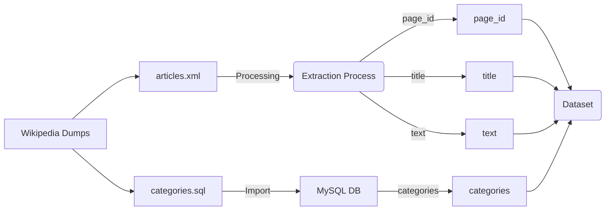

# mwcat

Generates a Dataset containing Wikipedia (english) pages with categories

Fields:
- page_id
- title
- categories: root category from each category found for the page
- text: 5 first sentences of the page (cleaned)

This dataset can be used to train a text classification model.

It uses Wikipedia dumps and runs a dockerized mysql server to query for
the page categories hierarchy.

Wikipedia has 40 top categories.

Requirements: Python 3, a good internet connection and a lot of time.

Run `make install` and then `make extract`

**WARNING**: This dataset will download over 100GiB of data from Wikipedia (once).
