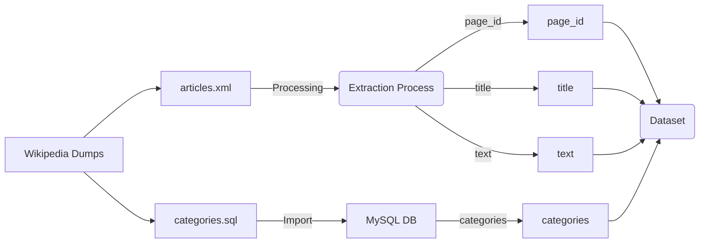

# mwcat

Project to create a text classification model using Wikipedia's top categories.

## Training and Validation Dataset

The training (80% split) & validation (20% split) dataset is composed of all wikipedia articles.

The `training.py` script generates two CSV files: `train.csv` and `validation.csv`.

Fields:

- page_id
- title
- categories: root category from each category found for the page
- text: 5 first sentences of the page (cleaned)

This dataset can be used to train a text classification model.

It uses Wikipedia dumps and runs a dockerized mysql server to query for
the page categories hierarchy.

Wikipedia has 40 top categories.

Requirements: Python 3, a good internet connection and a lot of time.

Run `make install` and then `make extract`

**WARNING**: This dataset will download over 100GiB of data from Wikipedia (once).

## Test dataset

XXX WIP

The test dataset (same size as the validation dataset) uses an LLM to classify text, making
the assumption that the result should be optimal and that the small model should try to do as well.

The test data is built with Common Crawl

XXX example https://skeptric.com/text-meta-data-commoncrawl

To avoid costs, the LLM is https://wandb.ai/byyoung3/ml-news/reports/How-to-Run-Mistral-7B-on-an-M1-Mac-With-Ollama--Vmlldzo2MTg4MjA0
