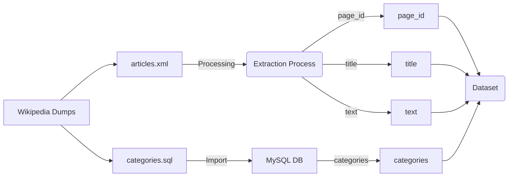

# mwcat

Project to create a text classification model using Wikipedia's top categories and
see if they can be used on any web page out there.

Wikipedia has 40 top categories that cover all popular topics.
It's a much better taxonomy than the classical AG News or Reuters one.

See https://en.wikipedia.org/wiki/Category:Main_topic_classifications

If the produced model is able to classify any web page against those topics,
it can be used in Firefox to group tabs per user intent.

The theory is that a user intent can be inferred from the categories from each page.

Proposed list of user intents / wikipedia topics matches :

1. **Researching for Academic Purposes**:

   - Academic disciplines, Science, Mathematics, Technology, Humanities, History, Philosophy

2. **Gathering News and Current Events**:

   - Mass media, Politics, Government, Society, Economy, International Relations, Culture

3. **Personal Entertainment**:

   - Entertainment, Sports, Culture, Music, Television, Film, Gaming

4. **Business and Financial Information Seeking**:

   - Business, Economy, Entrepreneurship, Corporate News, Stock Market, Industry Trends

5. **Educational and Learning Activities**:

   - Education, Academic disciplines, Science, Mathematics, Humanities, Language, Engineering

6. **Health and Wellness Information**:

   - Health, Medicine, Nutrition, Exercise, Mental Health, Diseases, Health Policies

7. **Shopping or Product Research**:

   - Business, Economy, Consumer Goods, Technology, Fashion, Food and Drink

8. **Travel Planning**:

   - Geography, Culture, Tourism, International Destinations, Local Attractions, Travel Tips

9. **Legal Information Search**:

   - Law, Government Policies, Legal Cases, Civil Rights, Legislation

10. **Environmental and Nature Exploration**:

    - Nature, Environment, Geography, Biology, Conservation, Climate Change

11. **Social Interaction and Communication**:

    - Communication, Social Media, Internet, Society, Culture, Human Behavior

12. **Exploring Philosophical and Ethical Questions**:

    - Philosophy, Ethics, Religion, Society, Humanities, History

13. **Understanding Global and Political Affairs**:

    - Politics, Government, International Relations, Law, Society, History

14. **Technology and Gadget Information**:

    - Technology, Engineering, Internet, Innovation, Gadgets, Computers

15. **Cultural and Artistic Exploration**:

    - Culture, Art, Music, Literature, Entertainment, History, Society

16. **Sports and Physical Activity Information**:

    - Sports, Health, Physical Fitness, International Competitions, Teams and Players

17. **Historical Information and Research**:

    - History, Culture, Geography, Politics, Military, Famous Historical Events

18. **Science and Research Updates**:

    - Science, Technology, Medical Research, Space Exploration, Physics, Biology

19. **Exploring Outer Space and Astronomy**:

    - Universe, Astronomy, Space Exploration, Physics, Science

20. **Career and Job Search**:
    - Business, Education, Career Development, Corporate Culture, Employment Trends

## Training and Validation Dataset

The training (80% split) & validation (20% split) dataset is composed of all wikipedia articles.

The `training.py` script generates two CSV files: `train.csv` and `validation.csv`.

Fields:

- page_id
- title
- categories: root category from each category found for the page
- text: 5 first sentences of the page (cleaned)

This dataset can be used to train a text classification model.

It uses Wikipedia dumps and runs a dockerized mysql server to query for the page categories hierarchy.

Requirements: Python 3, a good internet connection and a lot of time.

Run `make install` and then `make extract`

**WARNING**: This dataset will download over 100GiB of data from Wikipedia (once).

## Test dataset

XXX WIP

The test dataset (same size as the validation dataset) uses an LLM to classify text, making
the assumption that the result should be optimal and that the small model should try to do as well.

The test data is built with Common Crawl

XXX example https://skeptric.com/text-meta-data-commoncrawl

To avoid costs, the LLM is https://wandb.ai/byyoung3/ml-news/reports/How-to-Run-Mistral-7B-on-an-M1-Mac-With-Ollama--Vmlldzo2MTg4MjA0
